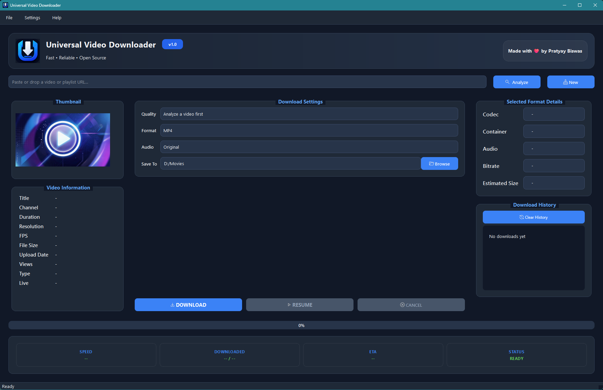
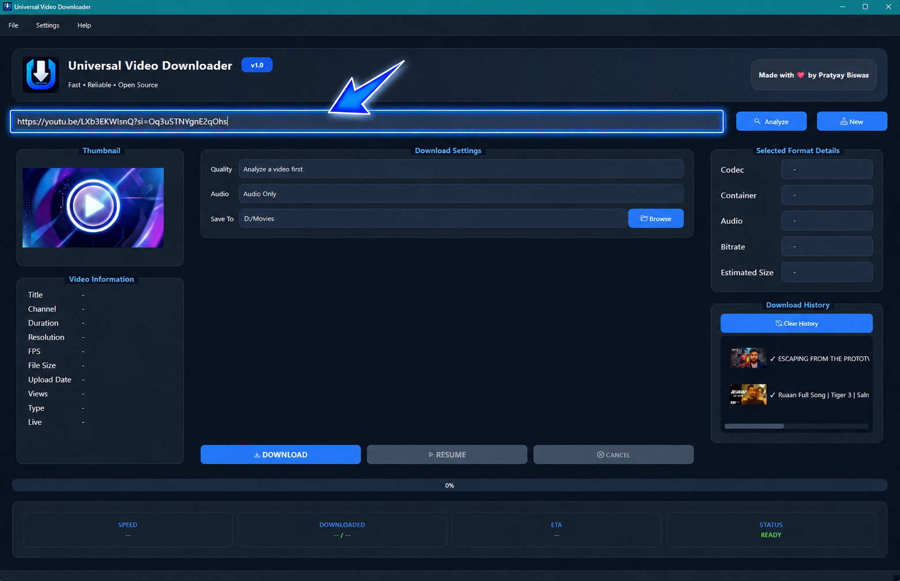
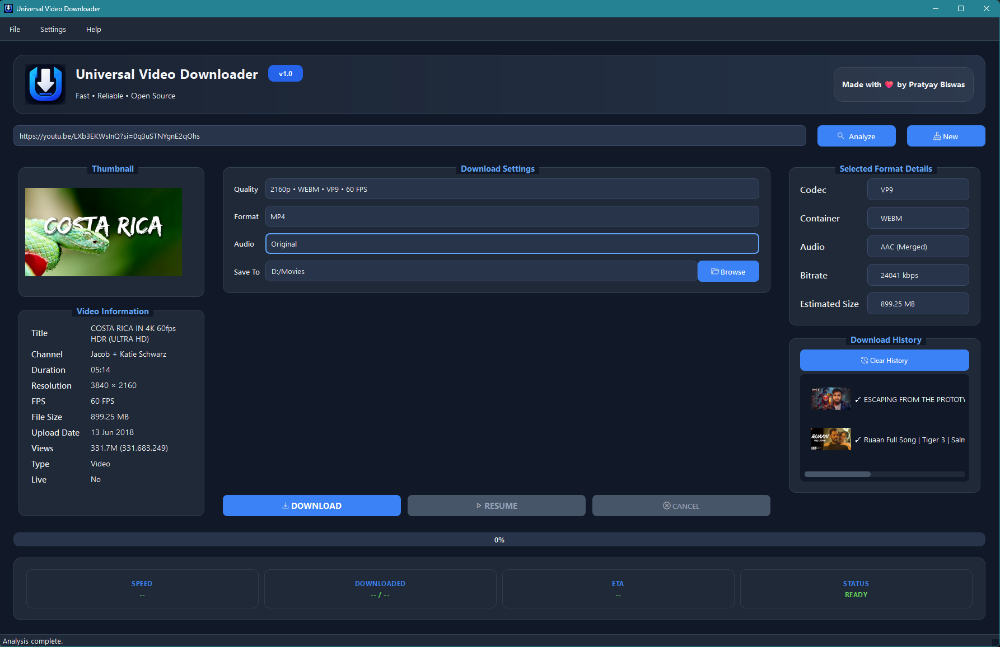
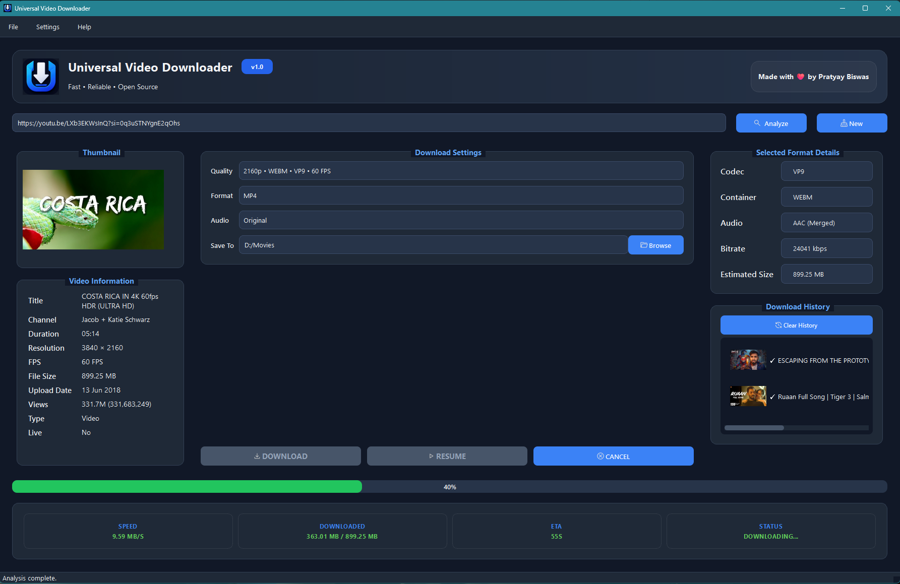

  

<h1 align="center">Universal Video Downloader</h1>

  

  <b>A clean, ad-free desktop client for downloading videos and audio.</b>

---

I built Universal Video Downloader because I wanted a straightforward GUI for `yt-dlp` and `FFmpeg` that didn't look like a relic from 2005. Written in Python and PySide6, it handles the heavy lifting of pulling media from most platforms while giving you format choices, resume support, and reliable progress tracking.

## Features

* **Multi-Platform Support:** Downloads video and audio from anywhere `yt-dlp` supports.
* **Format Analyzer:** See the exact codec, bitrate, and estimated file size before you download.
* **Live Previews:** Fetches thumbnails and detailed video metadata instantly.
* **Download Management:** Real-time speed and ETA tracking, with the ability to pause, resume, or cancel (automatically cleans up partial files).
* **Standalone:** Comes bundled with FFmpeg, so it works right out of the box.
* **Cross-Platform Architecture:** Windows builds are currently available, with Linux and macOS support planned.
* **Playlist Download Manager:** Copy and analyze the link of any YouTube playlist to see the playlist details and either download the entire playlist or download your selected ones. The choice is completely yours.

## Tech Stack

* Python
* PySide6 (Qt for Python)
* yt-dlp
* FFmpeg
* PyInstaller

## Installation

1. Grab the latest `UniversalVideoDownloader-v1.2-Windows-x64.zip` from the [Releases page](https://github.com/biswaspratyay/Universal_Video_Downloader/releases/latest).
2. Extract the folder anywhere on your PC.
3. Run `UniversalVideoDownloader.exe`.

> **Note:** Because the application isn't signed with a paid developer certificate yet, Windows SmartScreen will likely flag it. Click **More info** → **Run anyway** to bypass this.

## Download

### Just want to use the app?
Download **`UniversalVideoDownloader-v1.2-Windows-x64.zip`**

### Want to build or modify the project?
Download **Source code (zip)** or **Source code (tar.gz)**

> **Note:** The Source code archives do **not** contain a ready-to-run application.

## Usage

Using the app is pretty simple: just paste a supported URL, click **Analyze** to pull the available formats, pick the quality you want, and hit **Download**. You can also drag and drop URLs directly into the window.

## 📸 Screenshots

<i>Clean interface designed to keep everything in one place.</i>

---

<b>Paste URL</b> &nbsp;&nbsp;&nbsp;&nbsp;&nbsp;&nbsp;&nbsp;&nbsp;&nbsp;&nbsp;&nbsp;&nbsp;&nbsp;&nbsp;&nbsp;&nbsp;
<b>Analyze Video</b>

---

<i>Track download progress with live speed, ETA, and status updates.</i>

## License & Contributing

This project is open-source under the **MIT License**.

Bug reports, feature requests, and pull requests are welcome. If you find this tool useful, a ⭐ on the repo is always appreciated!
